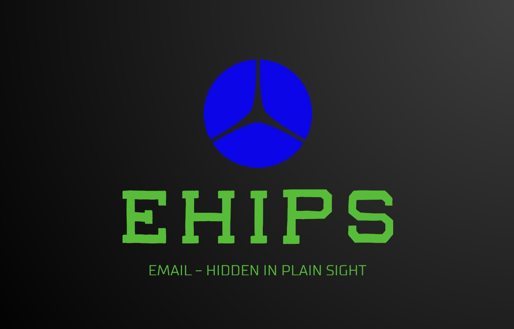

# Email Hidden Information and Pictorial Steganography (EHIPS)

EHIPS provides a unique feature to send emails with hidden messages. Follow the on-screen instructions to encode a message, and then use the program to send an email with the hidden message attached.

## Table of Contents
- [Introduction](#introduction)
- [Features](#features)
- [Dependencies](#dependencies)
- [Installation](#installation)
- [Usage](#usage)
- [Email Steganography](#email-steganography)
- [Contribution](#contribution)
- [License](#license)

## Introduction

Welcome to EHIPS, the Email Hidden Information and Pictorial Steganography tool! EHIPS is a Python-based program that allows users to encode and decode hidden information within text messages, providing a secure and creative way to share messages. Additionally, EHIPS supports steganography in emails, enabling users to send messages with hidden content.

## Features

- **Text Steganography:** Encode and decode hidden messages within text using Zero-Width Characters.
- **Clipboard Integration:** Copy encoded messages to the clipboard for easy sharing.
- **Email Steganography:** Send emails with hidden messages and decode them seamlessly.

## Dependencies

- `colorama`: ANSI color code terminal text output.
- `pyperclip`: Cross-platform clipboard module.
- `tabulate`: Pretty-print tabular data.
- `asciimatics`: Python package to produce full-screen text-based applications.
- `Pillow`: Python Imaging Library (PIL Fork).
- `pyfiglet`: Provides text banners.
- `numpy`: Library for numerical operations (used by Pillow).

## Installation

To install the required dependencies, use the following command:
`make install`
This command will install the necessary packages listed in the requirements.txt file.

## Usage
To run the EHIPS program, use the following command:
`make run`
Follow the on-screen prompts to encode, decode, send emails, and perform other actions!

## Email Steganography

One of EHIPS' standout features is the ability to incorporate steganography into emails, providing users with a creative and secure way to share messages with hidden content. This feature is particularly useful when you want to add an extra layer of privacy to your communications.

### How it Works

1. **Encode a Message:**
   - Start by choosing the email steganography option in the EHIPS program.
   - Use the built-in encoding functionality to embed a hidden message within a text of your choice.
   - The program employs Zero-Width Characters to encode the message, ensuring it remains invisible to the naked eye.

2. **Send Encoded Email:**
   - Once your message is encoded, EHIPS facilitates the process of sending an email with the hidden content attached.
   - You'll be prompted to provide essential details such as the sender's email address, password, receiver's email address, and the email subject.
   - Additionally, you can include a body for your email, making it appear like any regular communication.

3. **Attachment Handling:**
   - EHIPS saves the encoded message to a file named 'encoded_message.txt'.
   - This file is then attached to the email, ready to be sent to the intended recipient.
   - Recipients can download the attached file and use EHIPS to decode the hidden message seamlessly.

### Use Cases

- **Private Communication:**
  - Send sensitive information or personal messages with an added layer of confidentiality.
  - EHIPS allows you to share messages without revealing the hidden content at first glance.

- **Creative Messaging:**
  - Add an element of surprise or creativity to your emails.
  - Ideal for occasions like birthdays, anniversaries, or any special event where you want to make the message delivery more engaging.

- **Educational Purposes:**
  - Explore the world of steganography and its applications in a controlled environment.
  - EHIPS provides a user-friendly platform to understand and experiment with this intriguing form of communication.

### Security Considerations

While EHIPS provides an entertaining way to hide messages within emails, it's essential to remember that steganography, by its nature, is not foolproof for high-security applications. It adds an extra layer of privacy but may not withstand advanced cryptographic analysis. Users should be mindful of the intended use cases and the level of security required for their communications.

**Note:** Always ensure that the recipient is aware of the hidden content and the usage of EHIPS for decoding. Transparent communication is key to ethical steganography practices.

## Contribution
Contributions are welcome! If you want to contribute to EHIPS, please follow these steps:

Fork the repository.
- Create a new branch (`git checkout -b feature/your-feature`).
- Commit your changes (`git commit -m 'Add your feature'`).
- Push to the branch (`git push origin feature/your-feature`).
- Open a pull request.

## License
This project is developed by Jainam Kashyap (jk3862@drexel.edu) and (uj29@drexel.edu) for the purposes of education only!
